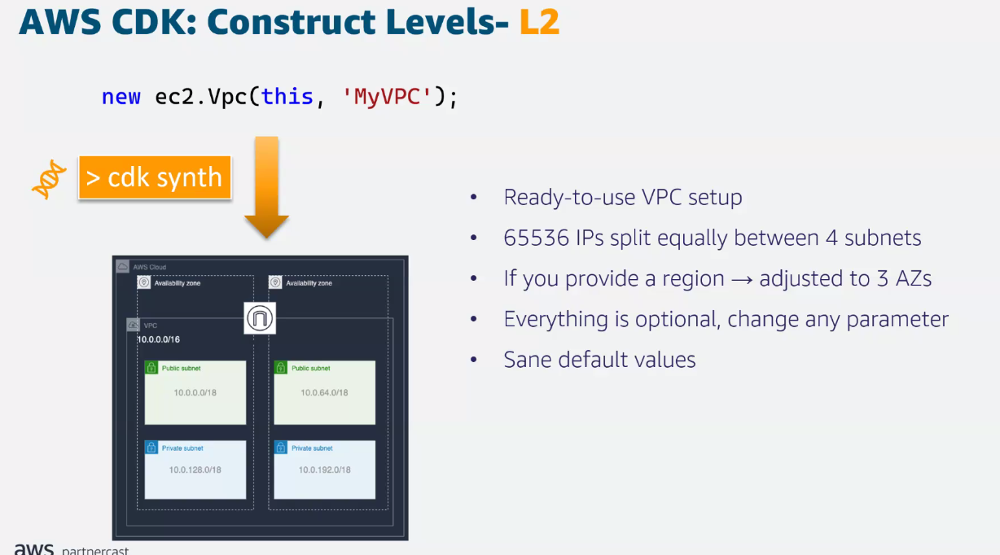
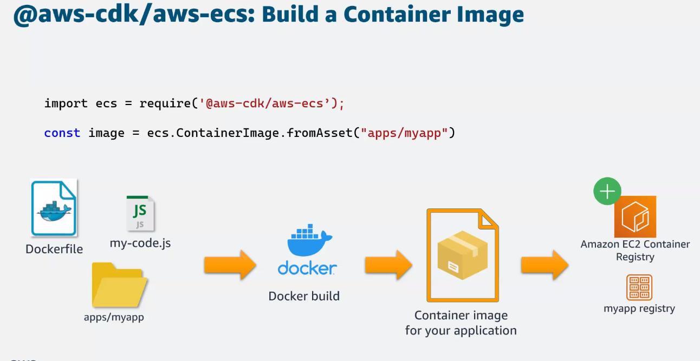

# Infrastructure as Code

## AES Parner Network Taining

> Jignesh Suthar

## CloudFormation - Ingfrastructure as Code

## Cloud Development Kit (AWS CDK)

## Fargate example

- Create VPC
- Make cluster
- Configure
  
Short code creates 37 resources and 289 lines of YAML

---

## Dev Workflow

## Paradigm Shift

## Main Componenets of AWS CDK

## Benefits of AWS CDK

- Use logic (if, for, while, etc.) when defining infrastructure
- Use object-oriented techniques to create a model of your system 
- Define high level abstractions
- Organize your project into logical modules
- Reuse your infrastructure as a library
- Use your existing code review workflow
- Code completion within your IDE

## AWS Construct Library

## Construct Levels

### Cloud Fromation Resources (CFN)

### AWS CDK - Construct Level 2

## Level 3

## AWS Solution Constructs Available

## CDK v2

## Construct Hub

- One home for all CDKs
- Open-source sharing
- AWS CDK
- Discover and share libraries
- CDK8s - kuernetes
- CDKTF - terraform JSON
- TS, Python, Java, C#, Go
- AWS, datadog, mongoDB, aqua, etc.

---

## Common Scenarios & How Tos

- Use an existing AWS CloudFormation Template

## AWS CDK For Containerized Applications

- SQS quegu
- Fargate type ECS with a couple lines of code

## ECS Patterns

## Resources

---

- Built on top of CloudFormation
- Makes CloudFormation templates
- 