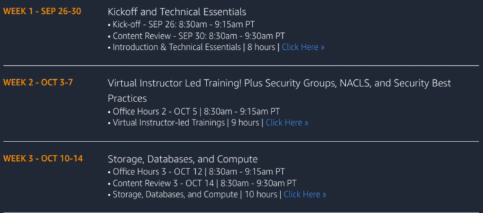
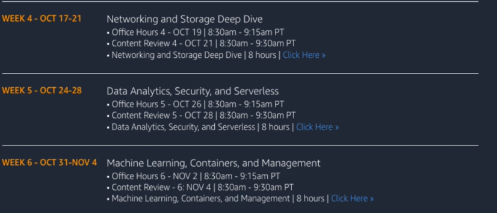

# AWS SOlutions Architect Associate

## Simplifying Your Certification Journey

> Myra Pelowski | Director - AMER Partner Training | AWS

- Schedule exam
- Raffle free exam vouchers to participants
  - Follow program guide and complete training when suggested

> KEvin Kline | Sr. Manager - AMER Partner Training | AWS

## Solutions Architect Associate Accelerator Homepage

- Weekly Program summary
- [Program Guide](https://mpa-saa-accelerator.splashthat.com/)
- Sessions recorded. Available [on-demand here](https://www.twitch.tv/aws_namer_programs)
- Sign up for individual skill builder monthly subscription
  - Hands-on labs
  - Full-length (65 questions) practice exams
  - $29/month
- Should be starting at the cloud practitioner level
- Time commitment
  - Minimum 8 hours per week to complete digital content
  - Do the training when you can
  - Try to keep up with the program
  - Designed for success on exam
  - 10-11 hours per week optimal
- Action items
  - [x] Sign up for APM with company email
  - [x] Sign into AWS Skill Builder as an AWS Partner
  - [x] Register for training (one-day block of **(2) Week-2** instructor-led sessions)
  - [ ] Complete Week One content
  - [ ] Register for week two classes

