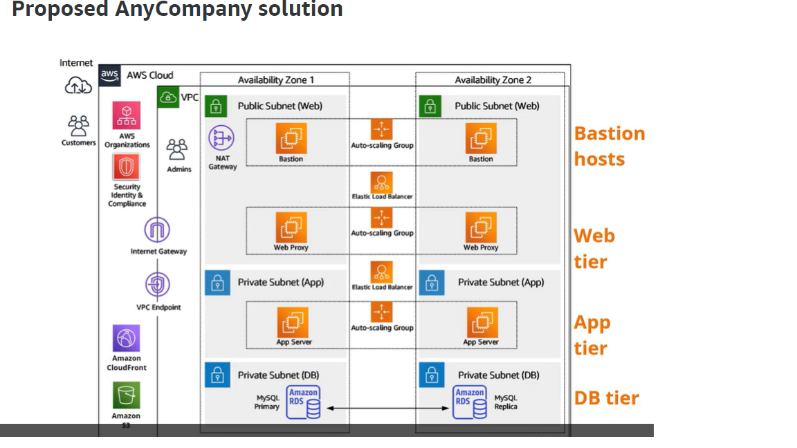

# Week 1: Introduction and Technical Essentials

---

## AWS Partner: Accreditation (technical)  (4 hours)

- Fundamental, technical knowledge of AWS cloud computing, global infrastructure, services, solutions, migration, and security.

### Objectives

- [ ] Articulate the value of key AWS services and features.
- [ ] Apply AWS services toward customer solutions.
- [ ] Adopt AWS architectural and cost optimization best practices.
- [ ] Present AWS solutions to customers.
- [ ] Demonstrate the value of constructing proofs of concept (POCs).
- [ ] Assemble an action plan for successful customer engagements.
- [ ] Identify APN resources for APN Partners.

### Meet Maria

- AWS Solution Architect at APN Partner
- Work in pre-sales technical assessments

### Cloud Computing Overview

#### Benefits of Cloud Computing

- Traditional on-premises - maintain physical servers
- On-demand delivery of compute power, database, storage, application, and other IT resources via the internet with pay-as-you-go pricing
- Cloud service provider owns and maintains hardware, users provision resources they need
- Agility
  - Easy access to a broad range of tech
  - Faster innovation
  - Quickly spin-up resources as needed
  - Deploy in minutes
  - Faster experimentation / testing / implementation
- Elasticity
  - No need to overprovision resources for peak loads
  - Use resources actually needed
  - Autoscale up and down as needs change
- Cost savings
  - Change CAPEX to OPEX
  - Economies of scale
- Deploy globally in minutes
  - Worldwide infrastructure
  - Deploy in multiple physical locations
  - Physically closer to user, reduce latency
- AWS Products
  - Compute
  - storage
  - database
  - analytics
  - networking
  - mobile
  - developer tools
  - management tools
  - IoT
  - security
  - enterprise applications

### AWS GLobal Infrastructure

- Multiple regions worldwide
- Completely isolated from other regions
- Fault tolerance
- Isolated from each other
- Multiple Availability Zones (AZs) within regions
  - Separate, but connected with low-latency fiber
- Local ZOnes
  - Compute, storage, and database close to large population centers
  - Wavelength Zones - 5g edge computing
  - Direct Connect Locations
    - Connect directly to AWS via private network
  - Cloudfront
    - Web service
    - Regional edge caches

### Compute

- Develop, deploy, run, and scale
- EC2 (Elastic Compute Cloud)
  - Secure
  - sizable
  - Over 400 instances with different cores, memory, os
- EC2 Auto Scaling
- Elastic Load Balancing
- Elastic Container Service (ECS)
  - Managed cluster
  - Docker
  - Fargate
    - Serverless pay as you go
    - ECS / EKS
- Elastic Kubernetes Service (EKS)
  - EC2 or Fargate
  - Automanages availability and scalability
- Lambda
  - Compute service
  - Serverless
  - Event-driven
- Benefits
  - Elasticity
    - Increase and decrease within minutes instead of hours or days
    - Maintain availability
    - Automatically scale up and down to maximize performance and minimize costs
  - Complete control
  - Flexibility
    - Many instance types
  - Integrated
    - Rith other AWS sercices
  - Reliable
    - High availability
  - Secure
    - Secure architecture
  - Cost Effective
    - Pay for what you use
  - Easy
    - Dashboard
    - CLI
    - SDK
- Instance types
  - Hardware and softare
  - Categories
    - General Putpose
      - mac
      - A
      - T
      - M
    - COmpute Optimized
    - Memory Optimized
    - Accelerated Computing
      - Coprocessors
      - Graphics
      - Pattern matching
      - Floating point operations
    - Storage Optimized
      - High sequential read/write access
  - Sizes
    - Nano
    - Small
    - Medium
    - large
    - xlarge
    - 2xlarge
  - AMI
    - Initial image
      - Linux
      - mac
      - Window
      - From AWS, AWS marketplace, user community, or own.
  - Autoscaling Group
    - Minimum
    - Maximum
    - Desired Capacity
  - Elastic Load Balancing
    - Automatically distributes traffic across multiple EC2 instances
    - Increases availability and fault tolerance
    - Configure health checks
    - Offload encryption and decryption
    - Application Load Balances
      - HTTP
      - Application Level
    - Network Load balancers
    - Gateway Load Balancers

### Storage

- Every time a server is set up, there needs to be storage
- S3 - object store
  - Storage for the internet
  - Store and retrieve any amount of data from anywhere
  - Glacier
    - Secure, digital backup and archive
  - Objects stored in buckets
  - Read, write, delete
  - Each object can be up to 5TB
  - No size limeits
  - 11 9s durability
  - 4 9s availability
  - Data lakes
    - Structured and unstructured data at any scale
    - AI / ML / HPC
  - Backup and storage
  - Application hosting
  - Media Hosting
  - Software delivery
  - Storage Classes
    - S3 Standard
    - S3 Standard - Infrequent Access
    - S3 - One Zone - Infrequent Access
    - S3 Glacier
      - Instant retrieval
      - Flexible retrieval
      - Deep Archive
      - Compliance
        - HEalthcare
        - Life science
        - Financial
    - Intelligent tiering
- AWS Storage Gateway
  - Hybrid cloud storage
  - Connect on-premises applications to AWS storage
  - File Gateway
    - NFS and SMB
  - Volume Gateway
    - iSCSI
  - Tape Gateway
    - VTL
- EBS - block store
  - Like hard drive for instance
  - Persistent
  - Durable
  - Block-level
  - Network attached storage
  - Independent of instance on / off
  - Automatically replicated within AZ
  - Can only be attached to one instance at a time
  - Can be reattached from new instance
  - Snapshots stored in S3
    - Instantiate new volumes
    - Copied across regions
  - 1 Gb to 16 TB
- EFS - file store
  - Network file system
  - Shared file system
  - Mount to multiple EC2 instances
- FSx for Windows File Server
  - Managed service
  - Windows file system
  - SMB

### Databases

- Broad base of purpose built databases for various use cases
- Offload time-consuming management tasks
- Amazon RDS
  - Managed
  - 6 engines
    - Aurora
    - PostgresSQL
    - mySQL
    - MariaDB
    - Oracle
    - SQL Server
  - Setup, operate, and scale
  - Cost-efficient, resizable capacity
  - Automated backup and restore
- DynamoDB
  - NoSQL
  - Single digit millisecond latency
- ElastiCache
  - Deploy, operate, and scale cache in cloud
  - Fast, managed, in-memory cache
- Managed
  - Easier to set up, manage or maingain
  - Reduce undifferentiated heavy lifting
    - Backup, recovery, patching, replication, monitoring, etc
  - Push button high availability
  - Automatic backup and recovery
  - Automatic scaling without licensing
- On EC2
  - More control / flexibility
  - Full control
    - System configuration
  - OS level
  - Commercial features not supported by AWS
- Remove day to day tasks with managed databases replace with value-added processes

### Networking

- VIrtual Private Cloud VPC
  - Build virtual private network in cloud
  - Advanced security features
  - Resembles traditional network
  - Complete control
    - Subnets
    - Route tables
    - Network gateways
    - IP ranges
    - NACLS
      - subnet level
    - Security Groups
      - Virtual Firewalls
      - Instance level
    - Flow logs
- Security groups
- Network access control lists
- Route 53 DNS services

### Security

- Highest priority and standards
- Inherent security in data center and network architecture
- Inherent best practices of AWS
- Flexible and agile
- Automation options
- Secure, high performance, resilient, compliant systems
- Infrastructure Protection
  - AWS Network Firewall
  - AWS Shield
  - AWS WAF
  - AWS FIrewall Manager
- Identity and access management
  - Manage access to services and resources securely
  - Users and groups
  - Assign permissions
  - Fine-grained access control
  - MFA
  - Analyze access
  - Integration with corporate directories
  - AWS IAM
  - AWS Single sign-on
  - AWS Organizations
  - AWS Resource Access Manager
  - AWS Directory Service
  - Amazon COgnito
- Detection
  - Amazon GuardDuty
  - Amazon Inspector
  - AWS CloudTrail
  - AWS Security Hub
  - AWS Config
  - AWS IoT Device Defender
- Data Protection
  - Amazon Macie
  - AWS CloudHSM
  - AWS Secrets Manager
  - AWS KMS
  - AWS Certificate Manager
- Compliance
  - AWS Artifact
  - AWS Audit Manager
- Incident Response
  - Amazon Detective
  - CloudEndure Disaster Recovery
- Shared responsibility model
  - AWS Responsible for security of the cloud
  - Customer responsible for security in the cloud
    - Access management
    - OS, network, firewall configuration
    - Client-side encryption and data integrity
    - Server-side encryption
    - Network traffic protection
      - encryption
      - integrity
      - identity
- Audited and accredited
  - CSA
  - ISO
  - GDPR
  - Industry certifications
  - security and control practices
  - Compliance reports directly from AWS
  - External certifying bodies and auditors
  - Assurance programs
  - Certifications and attestations
  - Laws, regulations, and privacy standards

### Overview Summary

- AWS Management Console
  - Graphical we interface to facilitate cloud management
- AWS Command Line Interface
  - Command line interface to facilitate cloud management
- Software Development Kits
  - Programming language specific libraries to facilitate cloud management
- All built upon REST APIs
- Service Breadth and depth
  - Databases
    - Relational
    - NoSQL
    - Caching
  - Analytics
    - Cluster computing
    - REal time
    - Data warehouse
    - Data Workflows
  - App Services
    - Queuing
    - Orchestration
    - App streaming
    - Transcoding
    - Email
    - Search
  - Deployment and management
    - Containers
    - DevOps tools
    - Resource templates
    - Usage tracking
    - Monitoring and logs
  - Mobile
    - Identity
    - Synch
    - Analytics
    - Notification
  - Foundation
    - Compute
    - Store
    - Network
  - Infrastructure
    - Regions
    - AZs
    - Edge locations

### Overview Knowledge Check

---

## From Services to Solutions

### Learning Goals - From Services to Solutions

- [ ] Adapt AWS solutions to meet customer challenges.
- [ ] Adapt AWS architectural and cost optimization best practices.
- [ ] Describing the customer challenge
- [ ] Outlining an initial AWS solution
- [ ] Diving deeper:
  - [ ] Migration approaches
  - [ ] Architectural best practices
  - [ ] AWS Well-Architected Framework
  - [ ] Use cases

### Introduction to solution design

- Solutions
  - ML
  - Analytics and Data Lakes
  - IoT
  - Serverless Computing
  - Containers
  - Enterprise Applications
  - Storage
  - Windows Workloads
- Combine services to meet customer challenges

### Addressing Customer Challenges

- Determine needs
  - Doesn't scale well with growth
  - Underprovisioned
  - Compliance issues with acquired partner
  - Relies upon contractor
  - Prefer less hands-on, managed solution
  - Monolithic
  - Two-tiered
  - MySQL
    - single server
    - Tape backup
- Design AWS Solution
  - Security
  - Availability
  - Cost-effectiveness
  - Customer stories / case studies

### Migration Strategies

- Seven Rs
  - Rehost
    - Lift and shift
    - Like for like transfer of resources from on-prem to cloud
    - Functional recreation of on=premises network
    - Pay as you go
    - Rapid redeployment
    - Can be automates AWS Application Migration Service
    - Easier to optimize and re-architect after migration
  - Replatform
    - Like Rehosting
    - Retains Core architecture
    - Migration to managed solution like Amazon RDS or Elastic Beanstalk
  - Relocate
    - Hypervisor lift and shift
    - VMware cloud on AWS
  - Refactor
    - Re-imagining how the application is architectted and developed
    - Could-native features
    - Monolithic to service-oriented
    - Containers / serverless
    - Managed Aurora DB
  - Retire
    - Shuttong off non-useful applications
    - REduce spend, management, security
  - Retain
    - Keeping certian applications on-premises
  - Repurchase
    - Moving workflows to SaaS

### Architectural Best Practices

- Design for failure and nothing fails
  - Assume failure and work backwards
  - Avoid single points of failure
  - Multiple instances
  - Multiple AZs
    - Robust availability
  - Separate single server into multiple tiered applications
- Build security in every layer
  - Encrypt data at rest and in transit
  - Enforce principle of least privilege
  - Implement security groups and NACLS
  - Advance security
    - GuardDrty, Inspector, Shield
- Leverage different storage options
  - One size does not fit all
  - Move static web assets to S2
  - CloudFront to serve globally
  - Store session state in Dynamo DB
    - Stateless web tier
- Implement elasticity
  - Autoscaling policies
  - Architect resiliency to reboots (AMI images)
  - Leverage managed service like S3 and DynamoDB
- Think parallel
  - Scale horizontally not vertically
  - More compute resources rather than more powerful compute resources
  - Decouple compute from session / state
  - Use elastic load balancing
  - Right-size infrastructure
- Loose coupling sets you free
  - Can scale and be made fault tolerant independentely
  - Use multiple queues instead of a single, ordered workflow
  - Uses SQS and SNS
  - Leverage existing services
  - email
  - queues
  - search
  - transcoding
  - monitoring
- Don't fear constraints
  - Rethink traditional architectures
  - More RAM?
    - Consider distributing load
  - More IOPS?
    - Scale horizontally
    - Read replica
    - Separate reads from writes
  - Response to failure?
    - Rip and replace
    - Decommission and spin up replacement

### AWS Well-Architected Framework

- Best practices
- Secure
- High performing
- Resilient
- efficient
- Sustainable
- Cloud-native way
- consistent approach to implementing design principles over six pillars
- Well-architected tool
  - Compares to best practices
- Pillars
  - Operational Excellence
    - Running and monitor systems to deliver business value and to continually improve supporting processes and procedures
    - Automate changes
    - Response to events
    - Defines standard operating procedures
  - Security
    - Confidentiality
    - Integrity of data
    - Privilege management
    - Detect events
  - Reliability
    - Prevent and quickly recover from failures
    - Recovery planning
    - Change management
  - Performance Efficiency
    - IT and computing resources are used efficiently to meet system requirements
    - Right resource types and sizes
    - Monitor and adjust
  - Cost Optimization
    - Avoid unnecessary costs
    - Scale to meet business needs without overspending
    - Right-sizing instances
    - Increasing elasticity
    - Choosing the right pricing model
    - Optimizing storage
  - Sustainability
    - Minimize environmental impact

### Cloud Adoption Framework (AWS CAF)

- Migrating to the cloud is a process
- Migrating applications takes effort
- Successful cloud migration require expertise
- Harness different perspectives
- Ensure you have the right talent
- Accellerating the path to successful cloud adoption
- Advice to organizations for smooth transition to AWS
- Six areas of focus called perspective
  - Business Capabilities
    - Business
      - Ensures IT aligns with business
      - Creates strong business case for cloud adoption
      - Ensure business aligns with IT
    - People
      - Change management strategy
      - Evaluate organizational structures and roles
      - Evaluate new skill and process requirements
      - Identify gaps
      - Prioritize training
      - HR, staffing, managers
    - Governance
      - Skills and processes align IT ad business practices
      - Ensure business values are maximized and risks are minimized
      - Measure business outcomes
      - CIO, program manager, enterprise architect, BA
  - Technical Capabilities
    - Platform
      - Implement new solutions in the cloud
      - Migrate on-prem to cloud
      - Understand and communicate structure of IT services and their relationships
      - Describe the architecture of the target state environment
      - CTO, IT managers, solutions architects
    - Security
      - Meets security objectives for visibility, audits, control, and agility
      - Structure the selection of security controls
      - CISO, IT security managers, IT security analysts
    - Operations
      - Enable, run, use, operate, and recover IT workloads
      - Align with and support business operations
      - Define operating procedures
      - IO operation managers
- Each perspective identifies gaps in skills and processes
- Use inputs as basis for creating action plan
- Guid an organization's change management
- Keep on track towards desired outcomes

### Case Studies

- Benefits of customer use cases
- Inspire confident
- Major operational change
- 49s less compelling than story from similar cstomer
- [AWS Customer Success](http://aws.amazon.com/solutions/case-studies/)

### Other Resources

- AWS SOlutions and AWS SOlutions apace
- Vetted, technical reference implementations designed to help customers solve common problems and uild faster
- AWS Competency Partner Solutions
- SOlution Briefs
- [AWS Quick Starts](http://aws.amazon.com/quickstart/)
  - Accelereate design solution
  - [ ] Find AWS Quick Start for Static web page

### Proposed Architecture

---

## Introduction to AWS AOrganizations (6 min)

---

## AWS Technical Essentials (4 hours)

---

## SAA Week 1 Content Review

---

## Building your first Amazon VPC (1 hour)

---

## Launching Amazon EC2 Instancess (1 hour)